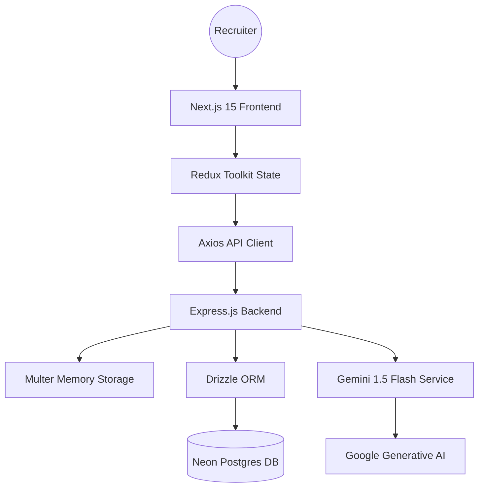
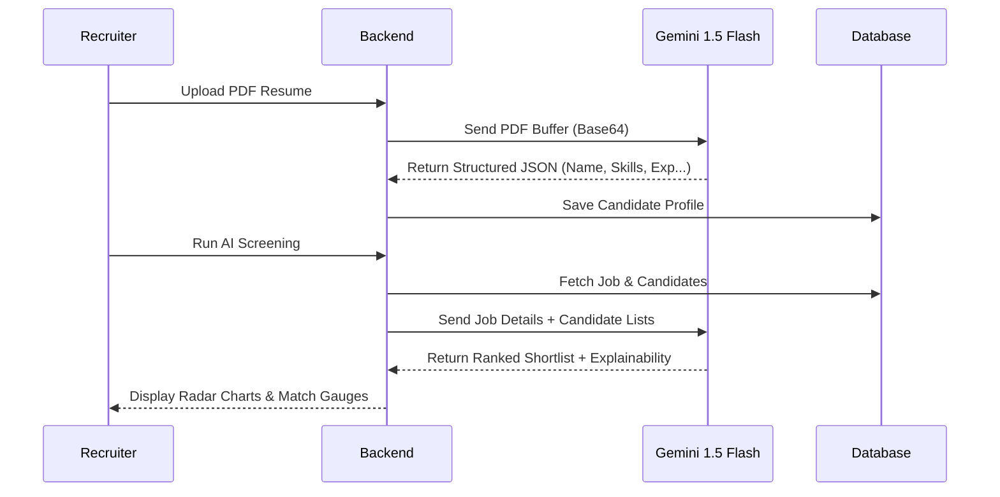

# 🏆 AI Recruiter: Roadmap

An advanced, AI-powered candidate screening and recruitment platform designed for the Umurava AI Hackathon. Built with **Next.js 15**, **Express.js**, **Neon Postgres**, and **Google Gemini 1.5 Flash**.

## 🚀 Key Features

- **AI PDF Parsing**: Seamlessly ingest candidate data from PDF resumes using Gemini 1.5 Flash multi-modal extraction.
- **Advanced Recruiter Analytics**:
  - **Skill Radar Charts**: Visual comparison of top candidates' skill portfolios.
  - **Score Distribution**: Bar charts showing the distribution of candidate rankings across the pipeline.
- **Intelligent Screening**: Automated ranking based on weighted criteria (Experience, Skills, Education, Role Relevance).
- **Pro-Grade Stack**: Fully migrated to **Redux Toolkit** for production-grade state management.
- **Multilingual Support**: Fully internationalized with `i18next`.

## 🏗️ Architecture

## 🧠 AI Screening Flow

## 🛠️ Setup & Installation

### Prerequisites
- Node.js 18+
- Neon Postgres Connection String
- Google Cloud Vertex AI / Gemini API Key

### Backend Setup
1. `cd backend`
2. `npm install`
3. Create `.env` with `DATABASE_URL`, `GCP_PROJECT_ID`, and `GCP_LOCATION`
4. `npm run db:push` (or `npx drizzle-kit generate` & `push`)
5. `npm run dev`

### Frontend Setup
1. `cd frontend-next`
2. `npm install`
3. Create `.env.local` with `NEXT_PUBLIC_API_URL=http://localhost:5000`
4. `npm run dev`

## ⚖️ Assumptions, Limitations & Justifications

### Database Choice Justification (Postgres vs MongoDB)
While the hackathon guidelines recommend MongoDB, **we engineered this platform using PostgreSQL (via Drizzle ORM on Neon).** The justification is simple: the **Talent Profile Schema** required by Umurava is highly structured. Postgres with `JSONB` columns allows us to strictly enforce data integrity on core fields (Name, Email, Job ID) while maintaining schemaless flexibility within `JSONB` blobs for unstructured skills and experiences. This prevents AI hallucinated data from breaking the DB at scale, a critical factor for enterprise HR tools over NoSQL.

### Assumptions
- **Parse Accuracy**: We assume PDFs uploaded maintain roughly standard resume flows (Experience -> Education -> Skills).
- **LLM Context Limit**: We cap the batch AI screening to Top 50 candidates per prompt to avoid Gemini 1.5 token overflow exhaustion.

### Limitations
- Highly visual PDF resumes (like complex graphic design portfolios with no selectable text layer) may trigger the Heuristic Rescue Engine instead of the AI parser if text extraction fails.

## 👨‍💻 Submission for Umurava AI Hackathon
Built by **Team Inganji** - Focusing on Engineering Quality, Technical Excellence, and Product Thinking.
