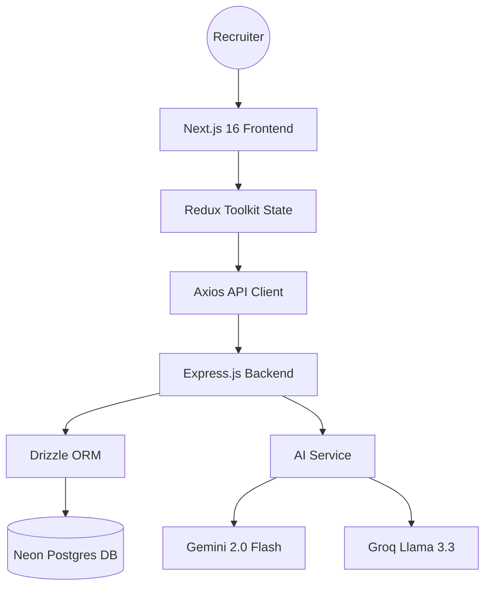
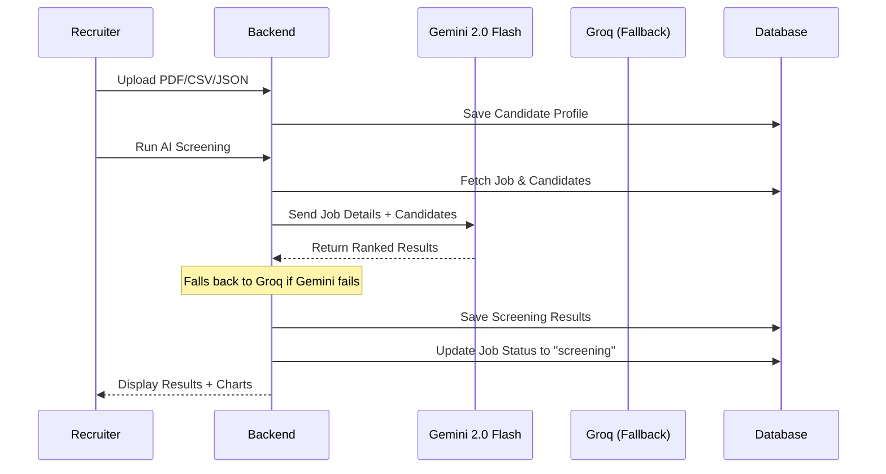

# 🏆 AI Recruiter: AIRECRUIT

An advanced, AI-powered candidate screening and recruitment platform designed for the Umurava AI Hackathon. Built with **Next.js 16**, **Express.js**, **Neon Postgres**, **Google Gemini 2.0 Flash**, and **Groq (Llama 3.3)** for AI processing.

## 🚀 Key Features

- **AI PDF Parsing**: Seamlessly ingest candidate data from PDF resumes using Gemini 2.0 Flash multi-modal extraction with Heuristic Rescue Engine fallback.
- **Multiple Import Formats**:
  - PDF Resume parsing
  - CSV bulk upload
  - JSON profile import (full schema support)
- **Job Status Management**: Track jobs through pipeline (open → screening → closed)
- **Advanced Recruiter Analytics**:
  - **Skill Radar Charts**: Visual comparison of top candidates' skill portfolios.
  - **Score Distribution**: Bar charts showing the distribution of candidate rankings across the pipeline.
- **Intelligent Screening**: Automated ranking based on weighted criteria:
  - Skills Match (40%)
  - Experience Years (25%)
  - Education Relevance (15%)
  - Project Alignment (20%)
- **Explainable AI**: Each candidate gets strengths, gaps/risks, and clear recommendations
- **Pro-Grade Stack**: Redux Toolkit for production-grade state management
- **Multilingual Support**: Fully internationalized with `i18next`

## 📋 Talent Profile Schema

The platform supports the complete Talent Profile Schema:

| Section | Fields |
|---------|--------|
| Basic Info | firstName, lastName, email, phone, headline, bio, location |
| Skills | name, level, yearsOfExperience |
| Languages | name, proficiency |
| Experience | company, role, startDate, endDate, description, technologies, isCurrent |
| Education | institution, degree, fieldOfStudy, startYear, endYear |
| Projects | name, description, technologies, role, link, dates |
| Certifications | name, issuer, issueDate |
| Availability | status, type, startDate |
| Social Links | linkedin, github, portfolio |

## 🏗️ Architecture

## 🧠 AI Screening Flow

## 🛠️ Setup & Installation

### Prerequisites
- Node.js 18+
- Neon Postgres Connection String
- Google Gemini API Key
- Groq API Key (optional, for fallback)

### Backend Setup
1. `cd backend`
2. `npm install`
3. Create `.env` with:
   - `DATABASE_URL` (Neon connection string)
   - `GEMINI_API_KEY`
   - `GROQ_API_KEY`
   - `JWT_SECRET`
4. `npm run db:migrate`
5. `npm run dev`

### Frontend Setup
1. `cd frontend-next`
2. `npm install`
3. Create `.env.local` with `NEXT_PUBLIC_API_URL=http://localhost:5000`
4. `npm run dev`

## 🔧 Recent Updates

- **Full Profile Schema Support**: JSON import now handles complete profile data
- **Job Status Management**: Manual status updates via dropdown (open/screening/closed)
- **Auto Status Update**: Job status automatically changes to "screening" after running AI screening
- **Enhanced Error Handling**: Debug logging for troubleshooting insert failures
- **Rate Limiting**: Configured for high-volume usage during development

## ⚖️ Technical Decisions

### Database Choice
Using PostgreSQL via Drizzle ORM on Neon. The structured Talent Profile Schema benefits from:
- Strict data integrity on core fields (Name, Email, Job ID)
- JSONB flexibility for unstructured skills, experience, projects
- Better query performance for filtering and sorting

### AI Fallback Strategy
1. **Primary**: Gemini 2.0 Flash
2. **Fallback**: Groq Llama 3.3 (70B Versatile)
3. **Final Rescue**: Heuristic Engine (rule-based scoring)

This ensures 100% uptime even if external AI services fail.

## 👨‍💻 Submission for Umurava AI Hackathon

Built by **Team Inganji** - Focusing on Engineering Quality, Technical Excellence, and Product Thinking.
